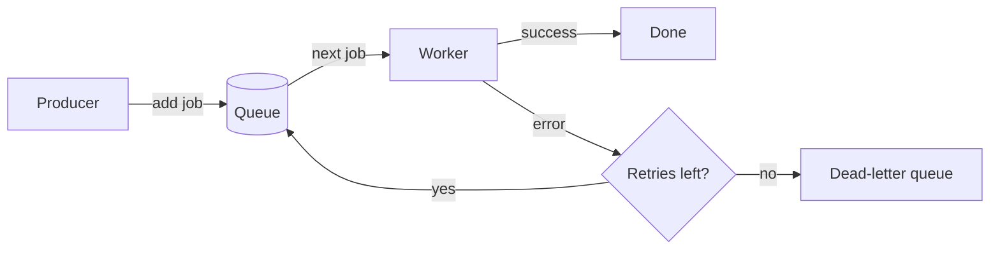

Lattice has three building blocks:

- A [job](./jobs.mdx) is a piece of typed data plus options.
- A [queue](./queues.mdx) stores jobs until a worker is free.
- A [worker](./workers.mdx) processes jobs and reports success or failure.

> [!TIP]
> Producers and workers can live in different processes, on different machines. They only share the job type and the queue name.
