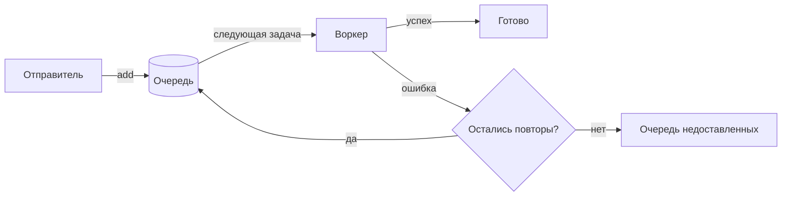

В Lattice три строительных блока:

- [Задача](./jobs.mdx) — типизированные данные плюс параметры.
- [Очередь](./queues.mdx) хранит задачи, пока не освободится воркер.
- [Воркер](./workers.mdx) обрабатывает задачи и сообщает об успехе или сбое.

> [!TIP]
> Отправитель и воркер могут жить в разных процессах и на разных машинах. Их связывают только тип задачи и имя очереди.
