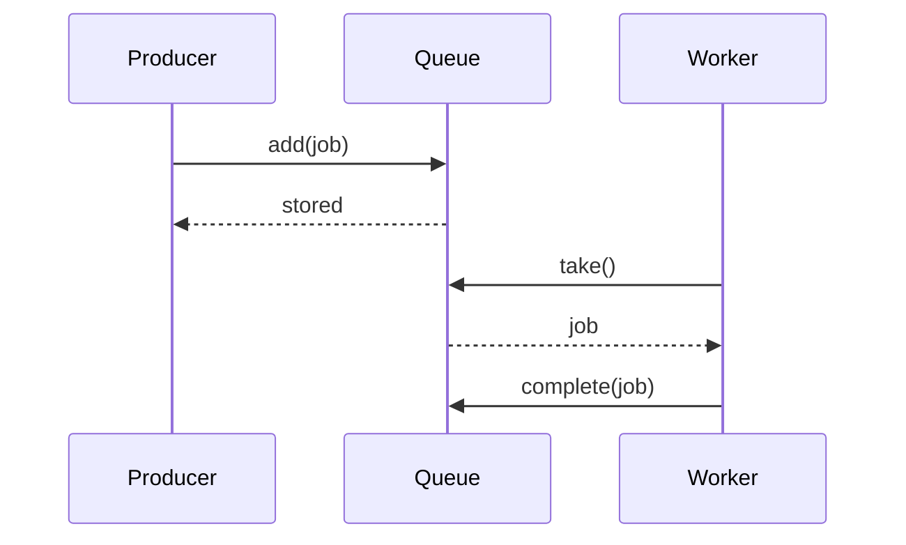
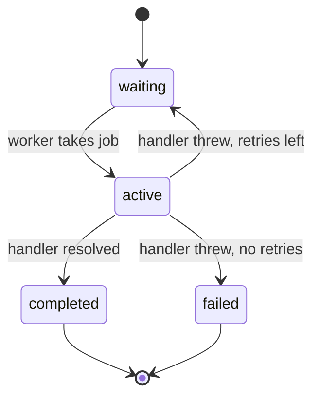

## Math

Inline math sits in a sentence: the sum of the first $n$ numbers is $\frac{n(n+1)}{2}$.

Display math gets its own line:

$$
\sum_{i=1}^{n} i = \frac{n(n+1)}{2}
$$

Formulas are rendered at build time with KaTeX, so there is no flash.

## Diagrams

Use a fenced `mermaid` block:

Diagrams follow the light and dark theme.
