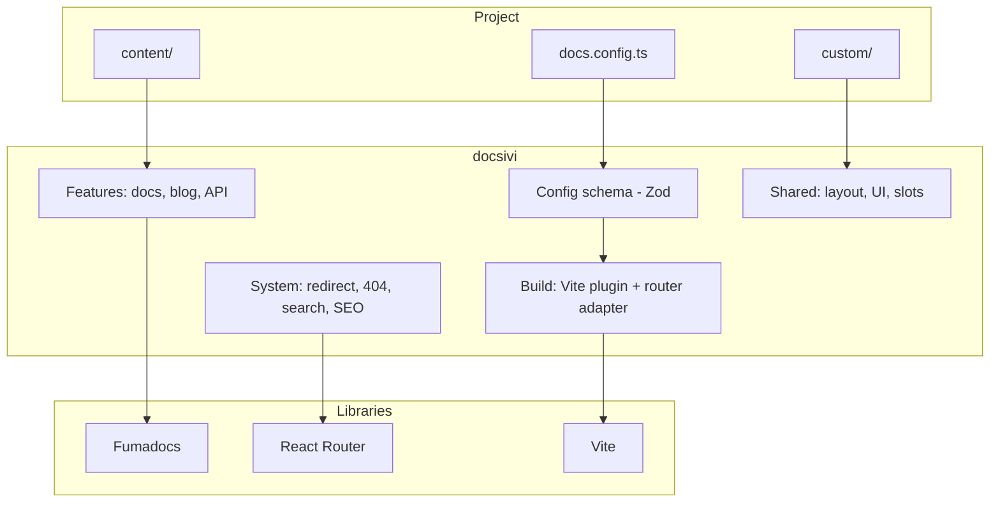
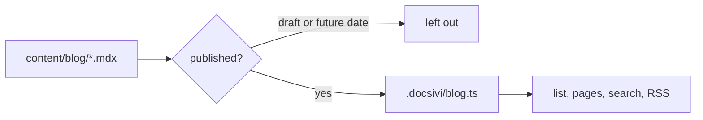

<Authors ids={["shiz-ceo"]} />

This is the first version of docsivi, so it is a good moment to write down where it came from. It is a long post. It covers the problem, the rule that shaped everything else, the decisions that changed along the way, and what is still missing.

<Callout type="info" title="Status">
  docsivi is a pre-release. The ideas are settled, the details will still move, and this post will
  be corrected before the first stable version.
</Callout>

## The problem

Every project I worked on ended up with a documentation site, and every one of them was a copy of something. Somebody took a template, changed the colors, added a page or two, and after that the site was theirs, together with the layout, the search, the build and the design system underneath.

That works for a month. Then a new version of the template arrives with a fix that you want, and your copy has diverged. Or you need a second language and discover that the copy was built for one. Or the person who understood the build leaves.

I wanted the opposite: a site where **the project only contains what is specific to it**, and everything else is a dependency that can be updated like any other.

## The rule

That became one rule, and I still check every decision against it:

> A project contains configuration, content and small pieces of its own. Everything else is a package.

In practice a docsivi project is a config file, a `content/` folder, an optional `custom/` folder and two files with one line each. There is no `app/` directory, no routes, no layout that you have to keep in sync.

```ts title="docs.config.ts" {4-6}
import { defineConfig } from "docsivi";

export default defineConfig({
  site: { name: "Lattice", github: { repo: "example/lattice" } },
  i18n: { languages: ["en", "ru"] },
  blog: { authors: { ada: { name: "Ada Novak" } } },
});
```

The rule has consequences. If the core has to be replaceable with `bun update`, then:

- every part of the site must be **configurable or replaceable** from the project, otherwise people will fork;
- the config must be **validated** strictly, because a typo has to be an error and not a silent no-op;
- the project's files must be **never written to** by the core, so an update cannot destroy anything.

## What I asked for

Before writing code I made a list of requirements, and it did not change much:

1. Languages and versions of the docs are **mandatory**, not an afterthought.
2. Customization by configuration, by plugins (Markdown, code blocks), by custom components and by design tokens.
3. Code blocks checked by the TypeScript compiler, but only the blocks that are marked for it.
4. A neutral, good looking default: Geist and a black and white palette.
5. Two ways to deploy: a Node server, or plain static files.
6. A demo site that looks like a real project, so that every feature is tested against realistic content.

## Standing on Fumadocs

I did not want to write a documentation UI from scratch. [Fumadocs](https://fumadocs.dev) already does the hard parts well: turning MDX into pages, a page tree with translations, search, a sidebar, a table of contents, and a good set of components.

The catch is that Fumadocs is a library and not a foundation. It expects you to own an app. docsivi's job is to be that app once, in a package, and to expose only the decisions that belong to a project.



## The decision that changed the most: leaving Next.js

The first version was built on Next.js, because Fumadocs started there. It worked, and I still rewrote it. Three things pushed me.

**The project was not only configuration.** Next.js wants an `app/` directory in the project. To keep it empty I had to fight the framework, generate files into the project and keep them in sync. Every attempt to hide the framework leaked.

**SEO is a set of routes.** A sitemap, `robots.txt`, `llms.txt`, social images and search endpoints are all routes that return something other than a page. In React Router these are *resource routes*, and they live in the package next to everything else.

**Static export is a first-class mode.** With React Router and Vite the same routes can be pre-rendered to plain files, or served by a Node server. It is the same code, with one flag.

<Expand title="What the migration looked like">

I moved everything to a branch and deleted Next.js completely, so there was no halfway version to maintain. The route modules moved into the package, and `defineRouterConfig(config)` hands the settings to the router. The generated pieces (the content instance, the routes, the root) went into a `.docsivi/` folder that is ignored by git.

The surprises were small and instructive:

- The `meta` function of React Router 8 receives the loader data and not a `data` object, so tags silently did not appear until I fixed it.
- A `redirect()` in a loader turns into a page with a two second delay when it is pre-rendered, so the redirect from `/en/docs` had to stay a real redirect on a server and become its own page in static mode.
- A static single-page build only accepts loaders on routes that are pre-rendered. A feature that is off must not register routes at all.

</Expand>

## Configuration you cannot get wrong

The config is a [Zod](https://zod.dev) schema, and unknown keys are errors:

```text title="Invalid docs.config"
✖ Unrecognized key: "blogg"
✖ i18n.defaultLanguage: defaultLanguage "de" must be one of: en, ru
```

Each error names the path of the option. When an option is renamed in the future, the old name keeps working and prints a warning that names the new one, so an update does not break anybody the same day.

## Pieces that a project can replace

The first customization tools were the obvious ones: design tokens for the look, `custom/components` for MDX, plugins for Markdown and code blocks. They took care of content.

The frame around the content took longer. A documentation site has a home page, a header and a footer, and they are usually the parts that a team wants to change first. The solution is a small set of **slots**:

```tsx title="custom/footer.tsx" {5-8}
import type { FooterSlotProps } from "docsivi";
import { DefaultFooter } from "docsivi/components";

export default function Footer(props: FooterSlotProps) {
  return (
    <>
      <DefaultFooter {...props} />
      {props.variant === "full" ? <p>Made in Berlin</p> : null}
    </>
  );
}
```

A slot is found automatically from `custom/`, or given in the config. It receives the site, the language and the default parts, so you can wrap the default instead of rewriting it.

The one principle that I would not give up is that the header and the footer are described **once** and every page uses them. A custom home page is drawn *inside* the common header and footer. There is no way to end up with two different headers by accident.

## A blog without leaks

A documentation project also needs announcements, so a blog is built in: categories, tags, search, authors, translations, RSS, social images and reading time.

The design question was about drafts. Hiding an unpublished post in the browser is not enough, because the text is still in the bundle. So unpublished posts are **never compiled**:



The list of files is made when the site starts. A draft is not in the list, so it is not in the build, the bundle, the search index or the feed. I checked that by searching the output for markers that only exist in a draft and a scheduled post.

## API references, and a detour

The API reference was the feature with a detour. I first wrote my own page for OpenAPI schemas: operations, models, a client. It grew fast, and then I stopped and asked what I was doing. [Scalar](https://scalar.com) already does this, it is MIT licensed, and it is maintained by people who care about nothing else.

Replacing my page with Scalar meant the work moved to integration: the theme has to follow the site (light and dark), the search moves into the header, and the sidebar has to fit next to the rest of the layout. That is a better use of time than a viewer.

The lesson generalizes to the whole project: **write the glue, not the parts**.

## How the code is organized

The core used to be organized by layers (components, routes, blog, theme). With three big features that meant every change touched five folders. I reorganized it around **features**:

```
packages/core/src/
├─ features/    home, docs, api-reference, blog
├─ system/      site (redirect, 404), search, seo
├─ shared/      layout, ui, slots, messages
├─ build/       Vite plugin and router adapter
└─ config/  mdx/  plugins/  theme/
```

A feature describes itself in one file (its routes, its link in the header, whether it is on), and the router, the header, the pre-render list and the sitemap are built from that list. Adding a section is a folder and a line.

| | Before | After |
| --- | --- | --- |
| A feature is in | up to five folders | one folder |
| Adding a section | edit routes, header, pre-render, sitemap | add a folder and a line |
| Turning a feature off | routes still registered | routes left out |

## What I learned

- **State the rule first.** "The project is only configuration" made hundreds of small decisions for me.
- **Delete the framework that fights the rule.** Leaving Next.js was the most expensive change and the best one.
- **Strict beats forgiving.** An unknown option that fails loudly costs a minute. One that is ignored costs an afternoon.
- **Dogfood every feature.** The demo and this site exist because a feature that is not used on a real site does not work.
- **Keep the parts that are not yours.** Fumadocs and Scalar do their jobs better than a copy of them would.

## What is missing

This is the first version, and there is a list:

- Publishing the package, and a `create-docsivi` generator.
- A smaller build. The demo site is around 25 MB because of generated images and diagrams.
- Hooks that let a plugin change the site itself and not only the Markdown.
- Feedback buttons on the pages of the docs.

If any of these matter to you, tell me. The order of the list is not fixed.

<CTA title="Try docsivi" description="Your first site takes five minutes." href="/docs/v0/quickstart" label="Read the quickstart" />
