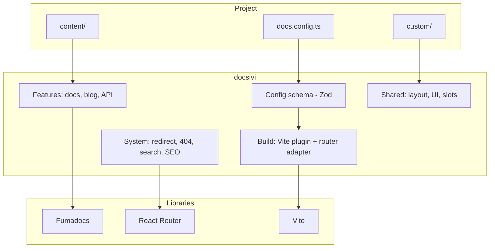
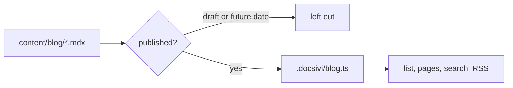

<Authors ids={["shiz-ceo"]} />

Это первая версия docsivi, так что самое время записать, откуда он взялся. Пост получился длинным. В нём рассказано о проблеме, о правиле, которое определило всё остальное, о решениях, менявшихся по ходу дела, и о том, чего пока не хватает.

<Callout type="info" title="Статус">
  docsivi — пререлиз. Идеи устоялись, детали ещё будут меняться, и этот пост будет поправлен
  до выхода первой стабильной версии.
</Callout>

## Проблема

В каждом проекте, над которым я работал, в итоге появлялся сайт документации, и каждый из них был чьей-то копией. Кто-то брал шаблон, менял цвета, добавлял пару страниц, и после этого сайт становился «его» вместе с вёрсткой, поиском, сборкой и дизайн-системой под ними.

Так можно прожить месяц. Потом выходит новая версия шаблона с исправлением, которое вам нужно, а ваша копия уже разошлась с оригиналом. Или вам нужен второй язык, и оказывается, что копия рассчитана на один. Или уходит человек, который понимал сборку.

Я хотел обратного: сайт, где **проект содержит только то, что для него специфично**, а всё остальное — зависимость, которую можно обновлять как любую другую.

## Правило

Так появилось одно правило, и я до сих пор сверяю с ним каждое решение:

> Проект содержит конфигурацию, контент и небольшие собственные фрагменты. Всё остальное — пакет.

На практике проект docsivi — это файл конфигурации, папка `content/`, необязательная папка `custom/` и два файла по одной строке. Нет каталога `app/`, нет маршрутов, нет шаблона, который нужно держать в синхронизации.

```ts title="docs.config.ts" {4-6}
import { defineConfig } from "docsivi";

export default defineConfig({
  site: { name: "Lattice", github: { repo: "example/lattice" } },
  i18n: { languages: ["en", "ru"] },
  blog: { authors: { ada: { name: "Ada Novak" } } },
});
```

У правила есть следствия. Если ядро должно заменяться командой `bun update`, то:

- каждая часть сайта должна **настраиваться или заменяться** из проекта, иначе люди начнут форкать;
- конфигурация должна **строго валидироваться**, потому что опечатка должна быть ошибкой, а не молчаливым игнорированием;
- ядро **никогда не должно записывать** файлы проекта, чтобы обновление ничего не могло разрушить.

## Чего я хотел

Прежде чем писать код, я составил список требований, и он почти не изменился:

1. Языки и версии документации — **обязательны**, а не приделаны потом.
2. Настройка через конфигурацию, плагины (Markdown, блоки кода), собственные компоненты и дизайн-токены.
3. Блоки кода, проверяемые компилятором TypeScript, но только те, которые для этого помечены.
4. Нейтральный, хорошо выглядящий вид по умолчанию: Geist и чёрно-белая палитра.
5. Два способа развёртывания: сервер на Node или обычные статические файлы.
6. Демо-сайт, похожий на настоящий проект, чтобы каждая возможность проверялась на реалистичном контенте.

## На плечах Fumadocs

Я не хотел писать интерфейс документации с нуля. [Fumadocs](https://fumadocs.dev) уже хорошо делает самое сложное: превращает MDX в страницы, строит дерево страниц с переводами, даёт поиск, боковое меню, оглавление и хороший набор компонентов.

Загвоздка в том, что Fumadocs — это библиотека, а не основа. Он ожидает, что у вас есть собственное приложение. Задача docsivi — один раз стать этим приложением внутри пакета и открыть только те решения, которые принадлежат проекту.



## Решение, изменившее больше всего: отказ от Next.js

Первая версия была построена на Next.js, потому что Fumadocs начинался именно там. Она работала, и всё равно я её переписал. Меня подтолкнули три вещи.

**Проект состоял не только из конфигурации.** Next.js требует каталог `app/` в проекте. Чтобы он оставался пустым, приходилось бороться с фреймворком, генерировать файлы в проект и держать их в синхронизации. Каждая попытка спрятать фреймворк протекала.

**SEO — это набор маршрутов.** Карта сайта, `robots.txt`, `llms.txt`, социальные картинки и конечные точки поиска — всё это маршруты, которые возвращают не страницу. В React Router они называются *resource routes* (ресурсными маршрутами) и живут в пакете рядом со всем остальным.

**Статический экспорт — полноценный режим.** С React Router и Vite одни и те же маршруты можно предварительно отрендерить в обычные файлы или отдавать сервером на Node. Это один и тот же код с одним флагом.

<Expand title="Как выглядела миграция">

Я перенёс всё в отдельную ветку и полностью удалил Next.js, чтобы не осталось промежуточной версии, которую пришлось бы поддерживать. Модули маршрутов переехали в пакет, а `defineRouterConfig(config)` передаёт настройки роутеру. Сгенерированные части (экземпляр контента, маршруты, корень) попали в папку `.docsivi/`, которую git игнорирует.

Сюрпризы были небольшими, но поучительными:

- Функция `meta` в React Router 8 получает данные загрузчика, а не объект `data`, поэтому теги молча не появлялись, пока я это не исправил.
- `redirect()` в загрузчике при предварительном рендеринге превращается в страницу с двухсекундной задержкой, поэтому редирект с `/en/docs` должен оставаться настоящим редиректом на сервере и становиться отдельной страницей в статическом режиме.
- Статическая сборка одностраничного приложения принимает загрузчики только у предварительно отрендеренных маршрутов. Выключенный раздел не должен регистрировать маршруты вообще.

</Expand>

## Конфигурация, в которой нельзя ошибиться

Конфигурация — это схема [Zod](https://zod.dev), а неизвестные ключи считаются ошибками:

```text title="Invalid docs.config"
✖ Unrecognized key: "blogg"
✖ i18n.defaultLanguage: defaultLanguage "de" must be one of: en, ru
```

Каждая ошибка называет путь к параметру. Если в будущем параметр переименуют, старое имя продолжит работать и выведет предупреждение с новым именем, так что обновление никого не сломает в тот же день.

## Части, которые проект может заменить

Первыми инструментами настройки были очевидные: дизайн-токены для внешнего вида, `custom/components` для MDX, плагины для Markdown и блоков кода. Они закрыли вопрос с контентом.

С оболочкой вокруг контента пришлось повозиться дольше. У сайта документации есть главная страница, шапка и подвал, и обычно именно их команда хочет изменить в первую очередь. Решением стал небольшой набор **слотов**:

```tsx title="custom/footer.tsx" {5-8}
import type { FooterSlotProps } from "docsivi";
import { DefaultFooter } from "docsivi/components";

export default function Footer(props: FooterSlotProps) {
  return (
    <>
      <DefaultFooter {...props} />
      {props.variant === "full" ? <p>Made in Berlin</p> : null}
    </>
  );
}
```

Слот находится автоматически в `custom/` или указывается в конфигурации. Он получает сайт, язык и стандартные части, поэтому можно обернуть стандартный вариант, а не переписывать его.

Один принцип, от которого я бы не отказался: шапка и подвал описываются **один раз**, и каждая страница их использует. Своя главная страница рисуется *внутри* общей шапки и общего подвала. Случайно получить две разные шапки невозможно.

## Блог без утечек

Проекту документации нужны и анонсы, поэтому блог встроен: категории, теги, поиск, авторы, переводы, RSS, социальные картинки и время чтения.

Вопрос дизайна был в черновиках. Скрыть неопубликованный пост в браузере недостаточно, ведь его текст всё равно остаётся в бандле. Поэтому неопубликованные посты **никогда не компилируются**:



Список файлов создаётся при запуске сайта. Черновика в списке нет, значит, его нет ни в сборке, ни в бандле, ни в поисковом индексе, ни в ленте. Я проверил это, поискав в результатах сборки маркеры, которые есть только в черновике и в отложенном посте.

## Справочники API и обходной путь

Справочник API оказался возможностью с обходным путём. Сначала я написал собственную страницу для схем OpenAPI: операции, модели, клиент. Она быстро росла, а потом я остановился и спросил себя, чем занимаюсь. [Scalar](https://scalar.com) уже это делает, он под лицензией MIT, и его поддерживают люди, которых больше ничего не волнует.

Замена моей страницы на Scalar означала, что работа переместилась в интеграцию: тема должна следовать за сайтом (светлая и тёмная), поиск переезжает в шапку, а боковое меню должно уместиться рядом с остальной вёрсткой. Это лучшее применение времени, чем написание просмотрщика.

Урок обобщается на весь проект: **пишите связующий код, а не сами части**.

## Как организован код

Раньше ядро было организовано по слоям (компоненты, маршруты, блог, тема). При трёх больших разделах это означало, что каждое изменение затрагивало пять папок. Я перестроил его вокруг **разделов**:

```
packages/core/src/
├─ features/    home, docs, api-reference, blog
├─ system/      site (redirect, 404), search, seo
├─ shared/      layout, ui, slots, messages
├─ build/       Vite plugin and router adapter
└─ config/  mdx/  plugins/  theme/
```

Раздел описывает себя в одном файле (свои маршруты, ссылку в шапке, включён ли он), а роутер, шапка, список предварительного рендеринга и карта сайта строятся из этого списка. Добавить раздел — значит добавить папку и одну строку.

| | До | После |
| --- | --- | --- |
| Раздел находится в | до пяти папок | одной папке |
| Добавление раздела | правка маршрутов, шапки, пререндера, карты сайта | добавить папку и строку |
| Отключение раздела | маршруты всё равно зарегистрированы | маршруты исключены |

## Что я понял

- **Сначала сформулируйте правило.** «Проект — это только конфигурация» приняло за меня сотни мелких решений.
- **Удаляйте фреймворк, который спорит с правилом.** Отказ от Next.js был самым дорогим изменением и лучшим.
- **Строгость лучше снисходительности.** Неизвестный параметр, который громко падает, стоит минуты. Игнорируемый — целого дня.
- **Пользуйтесь своим продуктом сами.** Демо и этот сайт существуют потому, что возможность, не испытанная на настоящем сайте, не работает.
- **Оставляйте части, которые вам не принадлежат.** Fumadocs и Scalar справляются со своей работой лучше, чем их копия.

## Чего не хватает

Это первая версия, и список есть:

- Публикация пакета и генератор `create-docsivi`.
- Сборка поменьше. Демо-сайт занимает около 25 МБ из-за сгенерированных картинок и диаграмм.
- Хуки, которые позволят плагину менять сам сайт, а не только Markdown.
- Кнопки обратной связи на страницах документации.

Если что-то из этого важно для вас, напишите мне. Порядок в списке не фиксирован.

<CTA title="Попробуйте docsivi" description="Ваш первый сайт займёт пять минут." href="/docs/v0/quickstart" label="Читать быстрый старт" />
