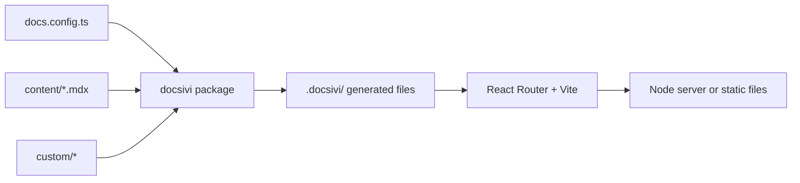

## A project is only configuration

A docsivi project has your content and a small amount of configuration. Everything else lives in the `docsivi` package: the routes, the page layout, the search, the theme, the build wiring.

That is what makes updates cheap. When a new version of the package comes out, you run `bun update docsivi`, and your project gets the fixes and the new features. There is no template to diff and no layout you forked two years ago.

## What happens when you run it

1. `docs.config.ts` is validated with Zod. A mistake stops the start with a message that names the option (`site.name`, `i18n.languages`, ...).
2. docsivi writes a few thin files into `.docsivi/`: the content instance, the root of the app, the list of routes, and the collections for the blog and the MDX home page.
3. Vite compiles the MDX (through Fumadocs), the styles (Tailwind) and the React Router app. The route modules come from the package, so they are never copied into your project.
4. In development the result is served with hot reload. In a build it is a Node server or a folder of files.

## The pieces

| Piece | Role |
| --- | --- |
| Fumadocs | Turns MDX into pages, builds the page tree, search and the docs UI |
| React Router | Routes, server rendering, pre-rendering, redirects |
| Vite | Development server and production build |
| Zod | Validates `docs.config.ts` |
| Tailwind | Styles, driven by the theme tokens |

## Parts of the site

The site is made of *features* and *system parts*.

- **Features** are the sections that you can switch on and off: the home page, the docs, the blog and the API reference.
- **System parts** are what every site has: the redirect from `/` to a language, the 404 page, search, the sitemap and `robots.txt`.

The header, the footer and the home page are defined once and every page uses them, so they stay the same everywhere. You can configure them or replace them: see [Home, header and footer](/docs/v0/configuration/layout) and [Slots](/docs/v0/customizing/slots).
