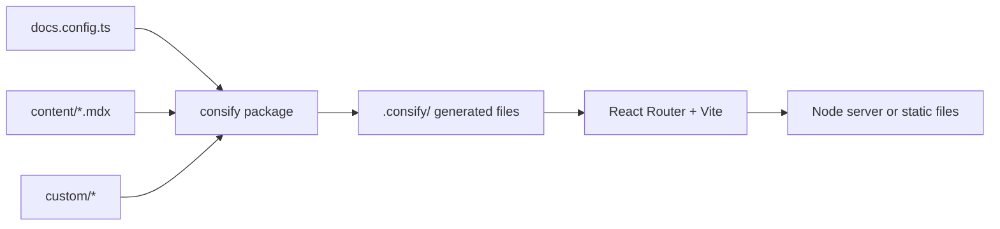

## Проект — это только конфигурация

Проект consify состоит из вашего контента и небольшого объёма конфигурации. Всё остальное живёт в пакете `consify`: маршруты, вёрстка страниц, поиск, тема, настройка сборки.

Благодаря этому обновления обходятся дёшево. Когда выходит новая версия пакета, вы запускаете `bun update consify`, и проект получает исправления и новые возможности. Не нужно сравнивать шаблон с вашей версией и не остаётся вёрстки, которую вы форкнули два года назад.

## Что происходит при запуске

1. `docs.config.ts` проверяется с помощью Zod. Ошибка останавливает запуск и выводит сообщение с названием опции (`site.name`, `i18n.languages`, ...).
2. consify записывает в `.consify/` несколько тонких файлов: экземпляр контента, корень приложения, список маршрутов и коллекции для блога и главной страницы на MDX.
3. Vite компилирует MDX (через Fumadocs), стили (Tailwind) и приложение на React Router. Модули маршрутов берутся из пакета, поэтому они никогда не копируются в ваш проект.
4. В разработке результат отдаётся с горячей перезагрузкой. В сборке это Node-сервер или папка с файлами.

## Составные части

| Часть | Роль |
| --- | --- |
| Fumadocs | Превращает MDX в страницы, строит дерево страниц, поиск и интерфейс документации |
| React Router | Маршруты, серверный рендеринг, предварительный рендеринг, редиректы |
| Vite | Сервер разработки и продакшен-сборка |
| Zod | Проверяет `docs.config.ts` |
| Tailwind | Стили, управляемые токенами темы |

## Части сайта

Сайт состоит из *разделов* и *системных частей*.

- **Разделы** можно включать и выключать: главная страница, документация, блог и справочник API.
- **Системные части** есть у любого сайта: редирект с `/` на язык, страница 404, поиск, sitemap и `robots.txt`.

Шапка, подвал и главная страница описываются один раз, и все страницы используют их, поэтому везде они выглядят одинаково. Их можно настроить или заменить: см. [Главная, шапка и подвал](/docs/v0/configuration/layout) и [Слоты](/docs/v0/customizing/slots).
