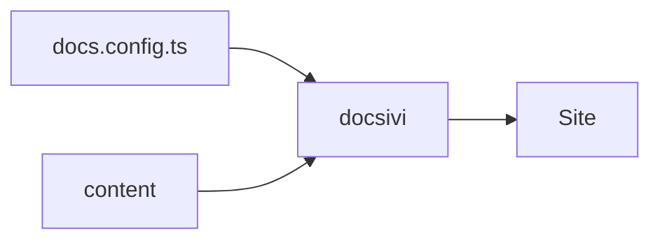
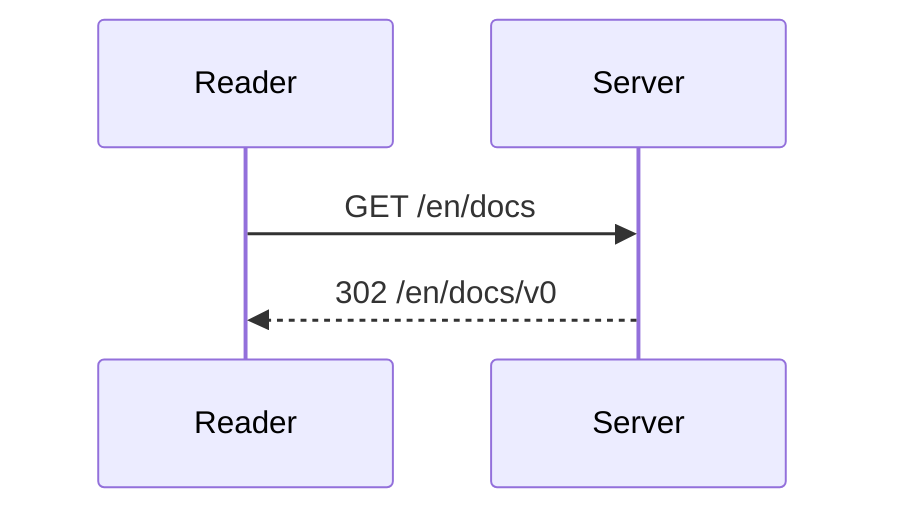

## Math

Inline math sits in a sentence: the sum of the first $n$ numbers is $\frac{n(n+1)}{2}$.

Display math gets its own lines:

$$
\sum_{i=1}^{n} i = \frac{n(n+1)}{2}
$$

Formulas are rendered at build time with KaTeX, so nothing flashes. Turn it off with `features.math`.

## Diagrams

A fenced `mermaid` block draws a diagram. It follows the light and dark theme.

````mdx

````





Mermaid is loaded only on pages that have a diagram.
