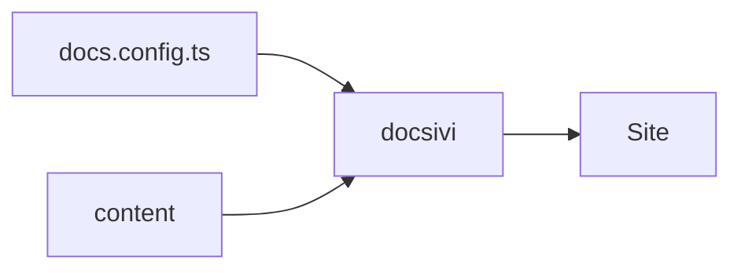
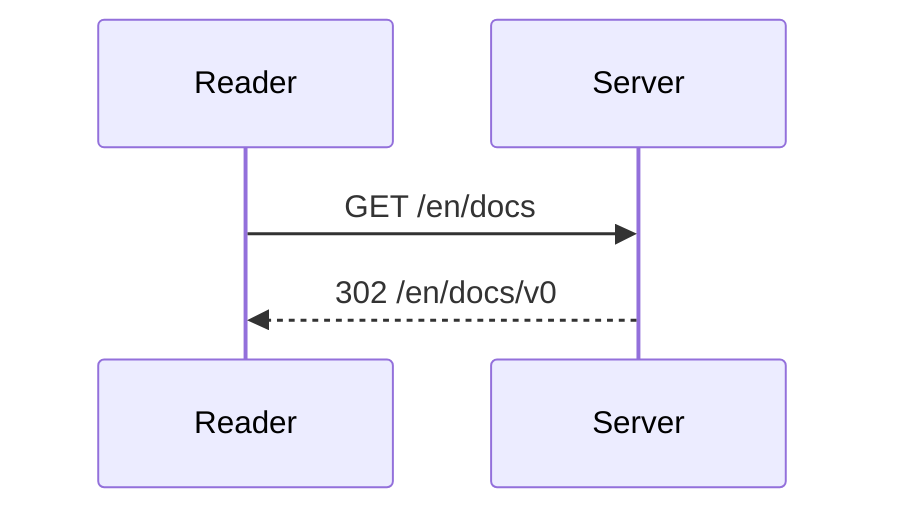

## Математика

Формула в строке встраивается в предложение: сумма первых $n$ чисел равна $\frac{n(n+1)}{2}$.

Выносная формула занимает отдельные строки:

$$
\sum_{i=1}^{n} i = \frac{n(n+1)}{2}
$$

Формулы рендерятся на этапе сборки с помощью KaTeX, поэтому ничего не мигает. Отключить можно через `features.math`.

## Диаграммы

Блок кода `mermaid` рисует диаграмму. Она следует светлой и тёмной теме.

````mdx

````





Mermaid загружается только на страницах, где есть диаграмма.
