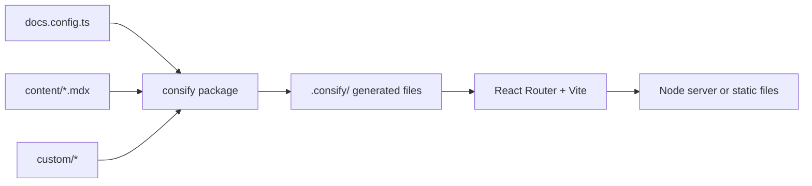

## A project is only configuration

A consify project has your content and a small amount of configuration. Everything else lives in packages: the core `@consify/core` (config, layout, theme, search, the build) and the features you list in `features` (the docs in `@consify/docs`, the blog in `@consify/blog`, each with its pages).

That is what makes updates cheap. When a new version of the package comes out, you run `bun update @consify/core @consify/docs`, and your project gets the fixes and the new features. There is no template to diff and no layout you forked two years ago.

## What happens when you run it

1. `docs.config.ts` is validated with Zod. A mistake stops the start with a message that names the option (`site.name`, `i18n.languages`, ...).
2. consify writes a few thin files into `.consify/`: the site object, the root of the app, the list of routes and one small module for every page of every feature.
3. Vite builds the React Router app and the styles (Tailwind). The pages come from the packages and from your `custom/` folder, so they are never copied into your project.
4. The content is read and its MDX compiled on the server, when a page loads it. Its front matter is checked against the schema of the feature, and a wrong field names the file.
5. In development the result is served with hot reload. In a build it is a Node server or a folder of files.

## The pieces

| Piece | Role |
| --- | --- |
| Fumadocs | The docs UI: sidebar, page tree, table of contents, the search dialog and its index |
| MDX | Compiles `.mdx` files on the server, with the plugins of `mdx` |
| React Router | Routes, server rendering, pre-rendering, redirects |
| Vite | Development server and production build |
| Zod | Validates `docs.config.ts` and the front matter of the content |
| Tailwind | Styles, driven by the theme tokens |

## Parts of the site

The site is made of *features* and *system parts*.

- **Features** are the sections of the site. Each one is made with `defineFeature`: an `id`, pages that are React components, and, if it needs them, content from `content/<language>/<id>/`, strings, files and links. The docs, the blog and the API reference are features from packages; one of your own can be a single file in `custom/features/`. A feature is on when it is in `features`. The front page is a built-in feature: `content/<language>/home.mdx`.
- **System parts** are what every site has: the redirect from `/` to a language, the 404 page, the sitemap and `robots.txt`. Core makes them from the pages of the features, as it makes the routes, the pre-rendering and the links of the header. The search dialog is core too, but what it searches comes from the section: the docs search their pages, the blog its posts.

The header, the footer and the home page are defined once and every page uses them, so they stay the same everywhere. You can configure them or replace them: see [Home, header and footer](/docs/v0/configuration/layout) and [Slots](/docs/v0/customizing/slots). Writing a feature of your own: [Features](/docs/v0/features).
