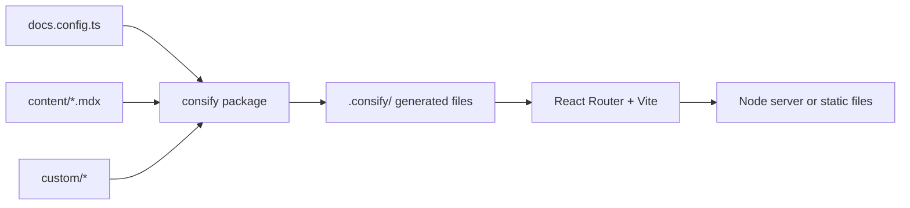

## Проект — это только конфигурация

Проект consify состоит из вашего контента и небольшого объёма конфигурации. Всё остальное живёт в пакетах: ядро `@consify/core` (конфиг, макет, тема, поиск, сборка) и фичи, которые вы перечисляете в `features` (документация в `@consify/docs`, блог в `@consify/blog`, у каждой свои страницы).

Благодаря этому обновления обходятся дёшево. Когда выходит новая версия пакета, вы запускаете `bun update @consify/core @consify/docs`, и проект получает исправления и новые возможности. Не нужно сравнивать шаблон с вашей версией и не остаётся вёрстки, которую вы форкнули два года назад.

## Что происходит при запуске

1. `docs.config.ts` проверяется с помощью Zod. Ошибка останавливает запуск и выводит сообщение с названием опции (`site.name`, `i18n.languages`, ...).
2. consify записывает в `.consify/` несколько тонких файлов: объект сайта, корень приложения, список маршрутов и по маленькому модулю на каждую страницу каждой фичи.
3. Vite собирает приложение на React Router и стили (Tailwind). Страницы берутся из пакетов и из вашей папки `custom/`, поэтому они никогда не копируются в ваш проект.
4. Контент читается, а его MDX компилируется на сервере, когда страница его загружает. Front matter проверяется по схеме фичи, и ошибка в поле называет файл.
5. В разработке результат отдаётся с горячей перезагрузкой. В сборке это Node-сервер или папка с файлами.

## Составные части

| Часть | Роль |
| --- | --- |
| Fumadocs | Интерфейс документации: боковая панель, дерево страниц, оглавление, диалог поиска и его индекс |
| MDX | Компилирует файлы `.mdx` на сервере, с плагинами из `mdx` |
| React Router | Маршруты, серверный рендеринг, предварительный рендеринг, редиректы |
| Vite | Сервер разработки и продакшен-сборка |
| Zod | Проверяет `docs.config.ts` и front matter контента |
| Tailwind | Стили, управляемые токенами темы |

## Части сайта

Сайт состоит из *фич* и *системных частей*.

- **Фичи** — это разделы сайта. Каждая делается через `defineFeature`: `id`, страницы в виде React-компонентов и, если нужно, контент из `content/<язык>/<id>/`, строки, файлы и ссылки. Документация, блог и справочник API — фичи из пакетов; ваша собственная может быть одним файлом в `custom/features/`. Фича включена, если она есть в `features`. Главная страница — встроенная фича: `content/<язык>/home.mdx`.
- **Системные части** есть у любого сайта: редирект с `/` на язык, страница 404, sitemap и `robots.txt`. Ядро строит их из страниц фич, так же как маршруты, предварительный рендеринг и ссылки шапки. Диалог поиска тоже часть ядра, но то, по чему он ищет, приносит раздел: документация ищет по своим страницам, блог по постам.

Шапка, подвал и главная страница описываются один раз, и все страницы используют их, поэтому везде они выглядят одинаково. Их можно настроить или заменить: см. [Главная, шапка и подвал](/docs/v0/configuration/layout) и [Слоты](/docs/v0/customizing/slots). Как написать свою фичу: [Фичи](/docs/v0/features).
