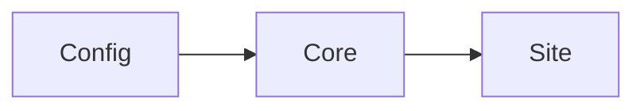

## Callout

<Callout type="warn" title="Heads up">Callouts come from Fumadocs.</Callout>

## Badge

<Badge variant="new">new</Badge> <Badge variant="beta">beta</Badge> <Badge variant="deprecated">deprecated</Badge>

## Tabs

<Tabs items={["bun", "npm"]}>
  <Tab value="bun">`bun add docsivi`</Tab>
  <Tab value="npm">`npm i docsivi`</Tab>
</Tabs>

## Steps

<Steps>
  <Step>First</Step>
  <Step>Second</Step>
</Steps>

## Math

Inline $E = mc^2$ and a block:

$$
\int_0^1 x^2\,dx = \tfrac{1}{3}
$$

## Code

```ts title="example.ts" {2}
const a = 1;
const b = a + 1; // [!code highlight]
console.log(b);
```

```ts twoslash
const greeting = "hello";
//    ^?
// @errors: 2322
const n: number = greeting;
```

## Mermaid



## Custom component and plugin

<Hello name="docsivi" />

External links open in a new tab via a custom rehype plugin: [example.com](https://example.com).
